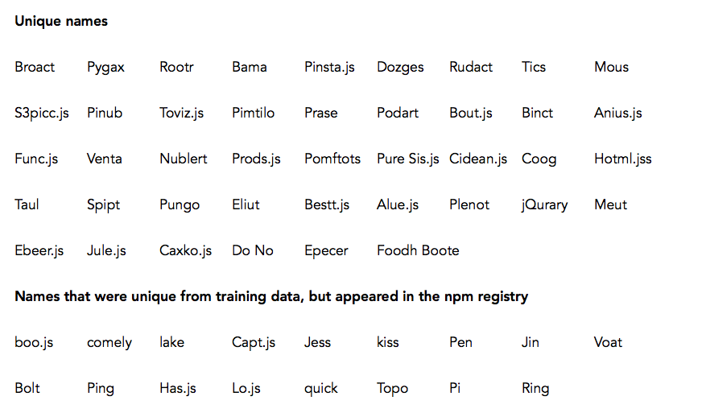
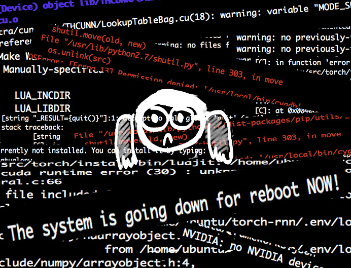

# torch-rnn

-----

This is a fork from the torch-rnn repo, which you can find [here](https://github.com/jcjohnson/torch-rnn). I used this to train a neural network that generated Javascript framework names:



## Data

If you're looking for just the generated names, you can find that in the `data` folder. `frameworks.txt` contains all the frameworks I used to train the neural network, `frameworks_sample.txt` contains the generated framework names, and `frameworks_selected.txt` has some of the generated names that I liked.

## Setup

For most of the setup, I followed the readme in the [original repo](https://github.com/jcjohnson/torch-rnn), as well as the readme from [jkeefe's fork](https://github.com/jkeefe/torch-rnn/blob/dognames/NOTES_JK.md). There a couple of things that I did specifically for my branch:

First, gathering the initial training data. Finding a listing of all Javascript libraries was surprisingly hard - I couldn't find any sort of directory on the npm website, so using [Javascripting](https://www.javascripting.com/) was my next-best choice. There wasn't any easy sort of table to copy-paste, so I ended up writing a BeautifulSoup scraper, which you can find in `scripts/scraper.py`. I ended up gathering 17*73=1241 framework names, which isn't a whole lot in the context of machine learning, but it was good enough for me. ¯\_(ツ)_/¯

After getting the data, I had to install all the torch stuff. I initially tried to install it on my computer, but that was kinda awful, so I set up an Amazon EC2 instance, as described in jkeefe's fork. EC2 sounded kinda intimidating - I've never used it before - but it was actually really straightforward to set up! Just follow the instructions on the Amazon website.

Once you get torch set up, run this to preprocess the data:

```
python scripts/preprocess.py \
  --input_txt data/frameworks.txt \
  --output_h5 data/frameworks.h5 \
  --output_json data/frameworks.json
```

Then, run this to train the data:

`th train.lua -input_h5 data/frameworks.h5 -input_json data/frameworks.json -gpu -1 -batch_size 15`

DON'T BE A DUMMY LIKE ME AND FORGET THE `-gpu -1` TAG AT THE END!!! THIS WASN'T EXPLICITLY STATED IN THE READMES, AND I SPENT TWO HOURS TRYING TO FIGURE OUT WHY CUDA OR WHATEVER WAS BREAKING MY COMPUTER. DON'T DO THAT!!! ):

The `-batch_size 15` part also tripped me up a bit. Because my training size was really small, the default of 50 messed me up when generating new samples. You don't necessarily have to use 15 - anything below a batch size of 20 should work.



After you survive the above steps, you can go ahead to the fun part: generating names! Go ahead and look in your `cv` folder. The checkpoints in there are what you'll need to generating names. For example, if there's a checkpoint called `checkpoint_1000.t7`, you can run:

`th sample.lua -checkpoint cv/checkpoint_1000.t7 -length 2000 > data/frameworks_sample.txt`

which will sample 2000 characters and put the new framework names in `data/frameworks_sample.txt`.

And that's it! Sample as many times as you want, and have fun with it!

